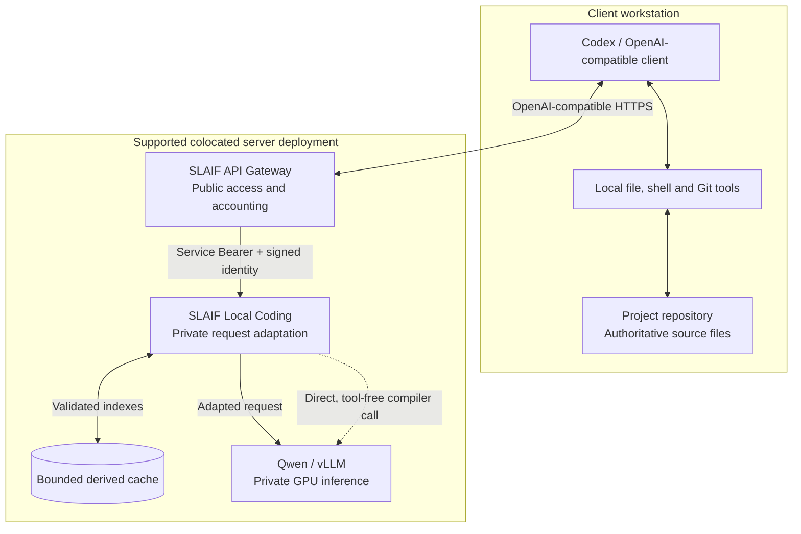
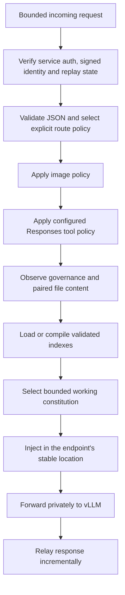
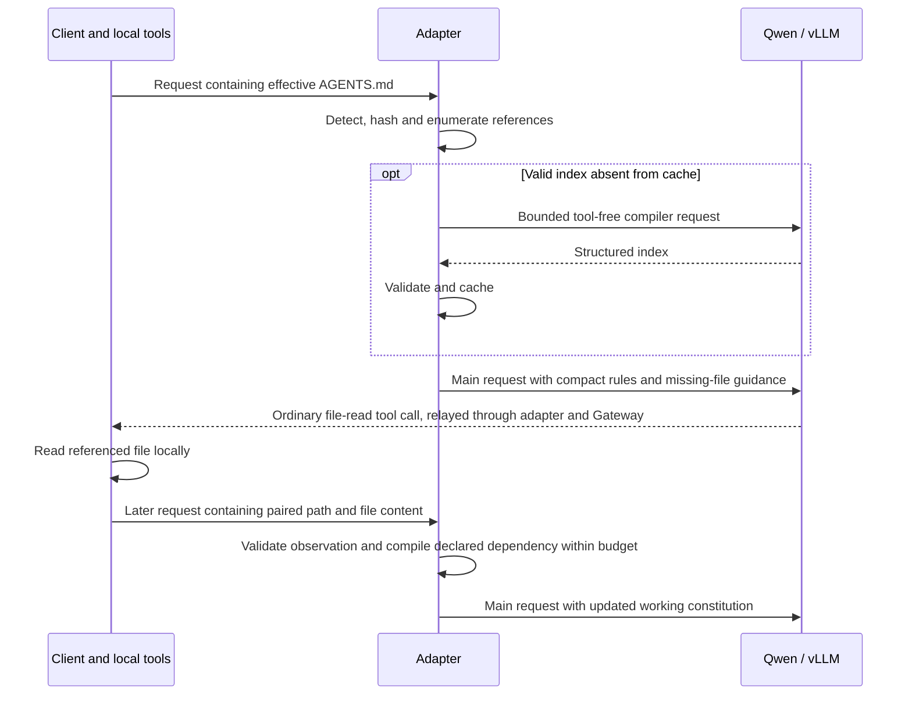
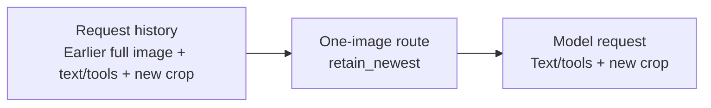

# SLAIF Local Coding architecture

SLAIF Local Coding sits immediately before a private model server. It adapts
requests from ordinary Codex and OpenAI-compatible clients to the capabilities
of a constrained local model, while preserving streaming, function tools and
ordinary API behavior.

Two problems drive the design: a local coding model needs project rules to
remain available after conversation history is compacted, and a one-image
vision model needs an explicit policy for requests containing earlier images
alongside a new crop. Both can be handled where the complete model-bound
request is available, without changing the client.

This guide explains the components, data flow and design limits. For deployment,
start with [QUICKSTART.md](QUICKSTART.md) or [INSTALL.md](INSTALL.md). Exact
configuration is described in [the configuration reference](docs/ADAPTER-CONFIGURATION.md);
implementation constraints are collected in
[the normative agent architecture](ARCHITECTURE-for-agents.md).

## System overview

The diagram shows logical ownership. In the canonical colocated deployment,
the Gateway runtime, adapter and model endpoint share the host network
namespace so both internal hops can use true loopback. The client repository
stays on the client workstation; the adapter has no mount or direct access to it.

| Component | Responsibility |
| --- | --- |
| Client | Conversation history and local tool execution, including reading repository files. |
| Separate [SLAIF API Gateway](https://github.com/ulfe-lmi/slaif-api-gateway) | Public keys, authentication, permissions, quotas, accounting, route administration and TLS. |
| Local Coding adapter | Private API forwarding, route policies, image adaptation, governance observation, compilation, cache and injection. |
| Qwen/vLLM | Model inference through its private OpenAI-compatible API. |
| Operator | Deployment, protected credentials, explicit policies, resource limits and recovery. |

The adapter is CPU-only. It does not load model weights, import a model runtime,
reserve GPU memory, decode images or start another vLLM process. Compiler calls
use the existing upstream model and therefore still consume inference capacity.

## Deployment and trust boundaries

The primary distribution is a pull-based Docker image for Linux `amd64`, with
Compose v2. The adapter container uses `network_mode: host`: its
`127.0.0.1:18020` upstream is the host's loopback, and its default listener is
`127.0.0.1:18031`. A direct-host systemd user service is the secondary path.
Docker installation needs no host Python, uv or local image build.

A Gateway in a bridge container or on another host cannot reach the adapter
through that Gateway's own `127.0.0.1`. The supported alternative uses an
explicit host-interface address on a declared trusted private LAN, with the
full signed ingress contract. A non-loopback adapter bind without that contract
is rejected. The adapter and vLLM remain private; only the Gateway is the public
entry point.

Signed requests authenticate identity and integrity; they do not encrypt
traffic. A private IP address alone provides no confidentiality. Broader
multi-host deployments require a separate transport decision. The supported
variants and namespace requirements are detailed in
[TOPOLOGY.md](docs/TOPOLOGY.md), with container isolation tradeoffs in
[DOCKER-SECURITY-DELTA.md](docs/DOCKER-SECURITY-DELTA.md).

### Authentication and identity

Public client keys terminate at the Gateway. On the Gateway-to-adapter hop,
production ingress requires a service Bearer credential and a separate HMAC
signature binding the method, path, raw query hash, exact body hash, opaque
principal, session, repository, route, timestamp and nonce.

Verification precedes image transformation, compiler/cache access and upstream
work. The signed route must match the selected route. Caller-supplied internal
headers cannot establish identity, and the adapter strips service credentials
and identity headers before forwarding with the private upstream credential.
Signed mode never falls back to a static identity.

Replay protection stores nonce digests in bounded process-local state. It keeps
a nonce through the inclusive signed timestamp horizon and configured retention
period. Capacity exhaustion and unsafe clock rollback fail closed rather than
evicting protected entries. This is a **single-worker contract**: replay state
is neither durable across restart nor shared across processes.

The exact wire contract is in
[SLAIF-GATEWAY-INTEGRATION.md](docs/SLAIF-GATEWAY-INTEGRATION.md). The frozen
Gateway compatibility authority belongs to the artifact's provenance record;
continuous contract testing does not silently change that release authority.

## Request lifecycle

This is the transformation path for supported model requests. Governance stages
run only when explicitly enabled. Health/model discovery and other accepted
passthrough requests do not undergo constitutional rewriting. Internal compiler
calls go directly upstream and never enter this pipeline again.

The API layer owns `/healthz`, `/readyz` and private `/metrics`. It proxies
`/health`, `/v1/models`, `/v1/responses` and `/v1/chat/completions`. It preserves
ordinary function-tool envelopes, supported reasoning settings, usage, status
codes and SSE event order, subject to documented header filtering and safe error
handling. It does not assemble an entire streaming response before forwarding;
a downstream disconnect closes upstream work.

Route configuration chooses supported model/endpoints and transformation
policies. Unknown or contradictory policies fail validation rather than being
guessed from request content. A configured Responses tool policy can remove
unsupported `tool_search` and `web_search` declarations; an explicit tool choice
that depends on a removed tool is rejected. Ordinary function tools remain
intact. This does not provide hosted tool execution or full OpenAI API parity.

## Keeping project rules available

A *constitution* is the effective project guidance rooted in `AGENTS.md`, plus
its binding referenced documents. The adapter compiles this guidance into a
small, validated representation and supplies it to subsequent applicable model
requests. Source files, Git, GitHub and human decisions remain authoritative.

Governance observation, compilation and injection are opt-in. The active
pipeline handles one complete root per request. Multiple or incomplete roots
preserve the request after image policy instead of choosing an arbitrary root.
A request with no root can reuse valid process-local context only when
rehydration is enabled and its complete identity matches.

### Observe first, then interpret

Detection requires envelope or path evidence: a supported Codex project
instruction envelope, an `AGENTS.md` input-file item, or a tool result paired
with a supported file-read operation. Merely mentioning `AGENTS.md` is not
enough. Only bytes actually received across the API boundary are available.

Before involving the model, deterministic code enumerates candidate repository
references and their evidence from links, quoted/backtick paths and supported
path-like text. It normalizes relative paths and rejects unsafe paths, traversal
and URLs. The model may classify and rank the candidates; it cannot silently
remove them from the manifest.

### Compile with a bounded internal call

On a cache miss, the compiler sends source text and the enumerated candidates
directly to the private upstream. The call is text-only, tool-free,
non-recursive, size-limited, time-limited and output-limited. Concurrent identical
misses are deduplicated; compiler concurrency defaults to one.

The result must pass a strict schema before entering the cache. It includes
binding rules and evidence, authority boundaries, exceptions, ordering
constraints, dependencies and conditions requiring a full-source reread. Two
separate scores prevent a common ambiguity:

| Field | Meaning |
| --- | --- |
| `reference_confidence` | How confidently the reference identifies a repository file. |
| `constitutional_priority` | How authoritative or important that file is if it exists. |

A clearly referenced example may have low authority; a less clearly formatted
security instruction can have high importance. Priority classes distinguish P0
root guidance, P1 delegated binding law/security, P2 procedures, P3 architecture
and contracts, and P4 background/examples.

The compiler treats the input as data. It cannot execute instructions, fetch a
URL, read the client filesystem or invoke client tools. Schema validation and
bounds constrain its output; they do not prove perfect semantic interpretation.

### Acquire dependencies through ordinary client tools

Missing binding dependencies produce guidance to read the exact files before
substantive mutation. Acquisition depends on the client's ordinary tools and
supported path/content pairing; the adapter does not independently fetch files
or ingest unrelated tool output. The dependency acquisition budget is finite.

### Select and inject

The working set uses a deterministic order: root P0, acquired P1, missing P1
acquisition guidance, then relevant acquired P2/P3 entries within the remaining
budget. P4 is omitted. Optional entries are omitted whole; essential rules are
never silently truncated to fit.

Injection uses Responses `instructions` or the earliest appropriate Chat system
location. The marker identifies reconstructed context and makes clear that
source documents override it. Identical version/content is idempotent;
unexpected marker collisions or unsafe request shapes fail closed. Tools,
continuation identifiers and other unrelated fields are preserved.

After successful injection, bounded process-local state retains validated
indexes and inclusion metadata. A later request with reduced history can
reselect and inject them without another compiler call. This state expires and
is lost on restart. It restores available guidance at the model boundary; it
does not guarantee that a client will compact less often or that a model will
follow every rule.

## Cache and state lifetime

| State | Contents and lifetime |
| --- | --- |
| Request memory | Observed source and request data needed for that request; no raw-payload persistence. |
| Compiled-index cache | Validated derived indexes; bounded filesystem storage with TTL, LRU and a separate bounded P0/P1 budget. |
| Rehydration map | Validated indexes and selection metadata for matching later requests; process-local, TTL/LRU/byte bounded. |
| Client repository | Full authoritative documents and history; never replaced by adapter state. |

Cache identity incorporates principal, session/repository, source hash and
compiler/schema/model/policy versions. Rehydration also binds selection/render
policies and bounds. A changed source or incompatible version cannot silently
reuse an old index. Missing, expired or evicted state is a cache miss.

The default cache location is `/dev/shm/slaif-local-coding`, with a protected
XDG filesystem fallback. Directories use `0700`, files `0600`, and writes are
atomic. Per-entry, total and pinned budgets are enforced. Derived text is still
sensitive even though raw prompts, images, source and tool output are not
persisted. Cache deletion must never destroy authoritative information.

## Image adaptation

Image policy is explicit per route: `retain_newest`, `reject` or `passthrough`.
The designated one-image Codex route uses `retain_newest`. It keeps the newest
supported image content item by request traversal order and leaves non-image
content and its relative order intact.

Responses `input_image` and Chat `image_url` shapes are supported. Zero- and
one-image requests remain unchanged by image adaptation. For multiple images,
the result is checked against the route limit; unsafe over-limit shapes fail
closed. Images are neither decoded nor re-encoded.

Retaining a crop makes the full-image-then-crop workflow usable on a one-image
model. It does **not** preserve an intentional two-image comparison. Such a
workflow needs a capable route or an explicit rejection policy.

## Failure behavior and observability

| Condition | Behavior |
| --- | --- |
| Invalid authentication, identity, route signature or replay | Reject before transformation or upstream work. |
| Malformed or oversized transformable request | Return a bounded client error; no unsafe bypass. |
| Compiler timeout, invalid output or cache failure | Preserve original governance when safe; never cache invalid output as valid. Image enforcement remains independent. |
| Ambiguous/incomplete root or essential working-set overflow | Preserve the post-image request instead of deleting or truncating governance. |
| Missing or expired rehydration state | Preserve the request; no invented context or cross-principal reuse. |
| Unsafe image shape or marker collision | Reject explicitly. |
| Upstream unavailable | Return a sanitized gateway error; readiness fails. |
| Downstream disconnect | Close upstream work and release resources. |

Resource bounds cover request bytes, JSON structure, source size, compiler
output/time/concurrency, injection size, cache occupancy and replay state.
Streaming reduces response memory pressure; compiler overhead remains a separate
capacity cost. Gateway reservation/final accounting stays with the Gateway,
using provider usage where available.

Operators use process liveness, readiness and private Prometheus-compatible
metrics. Metrics report fixed states, counts and timings for requests,
transforms, compiler/cache outcomes and failures. Raw prompts, repository text,
images, tool output, bodies, credentials and compiled content are excluded from
logs and metrics. See [SECURITY.md](SECURITY.md) for the privacy and protected-host
rules, and [DEPLOYMENT.md](docs/DEPLOYMENT.md) for operational procedures.

## Implementation map

The implementation uses Python 3.12, FastAPI/Starlette, HTTPX, Pydantic and
Uvicorn, with locked dependencies managed by uv.

| Area | Source |
| --- | --- |
| API, ordered pipeline and streaming | [app.py](src/slaif_local_coding/app.py) |
| Validated runtime and route configuration | [config.py](src/slaif_local_coding/config.py) |
| Signed identity and replay protection | [gateway_identity.py](src/slaif_local_coding/gateway_identity.py) |
| Image and Responses tool policies | [image_policy.py](src/slaif_local_coding/image_policy.py), [tool_policy.py](src/slaif_local_coding/tool_policy.py) |
| Evidence-based observation and candidate enumeration | [detector.py](src/slaif_local_coding/constitution/detector.py), [references.py](src/slaif_local_coding/constitution/references.py) |
| Compilation and strict index contracts | [compiler.py](src/slaif_local_coding/constitution/compiler.py), [compiler_models.py](src/slaif_local_coding/constitution/compiler_models.py) |
| Derived cache | [cache.py](src/slaif_local_coding/constitution/cache.py) |
| Dependency acquisition and rehydration | [pipeline.py](src/slaif_local_coding/constitution/pipeline.py) |
| Working-set selection and endpoint injection | [working_set.py](src/slaif_local_coding/constitution/working_set.py), [injection.py](src/slaif_local_coding/constitution/injection.py) |
| Service entry point | [cli.py](src/slaif_local_coding/cli.py) |

## Verification, artifacts and limits

Verification combines pure unit tests, fake-upstream API/SSE/tool/disconnect
tests, security and isolation tests, pinned Gateway contract tests, and
reproducible artifact and disposable Docker qualification. Bounded live vLLM
and actual Codex tests supply separate fixture-specific evidence; a fake test
cannot substitute for either. Exact commands and status meanings are in
[TESTING.md](TESTING.md).

The reference evidence is Qwen3.8-27B/vLLM on one RTX 3090 with 24 GB VRAM.
[Vision acceptance](docs/VISION-ACCEPTANCE.md) records the qualified fixture;
this is not generic hardware support, hostile multi-tenant certification,
frontier-model equivalence or a guarantee of instruction fidelity. Model context
and image limits depend on the selected serving configuration.

The wheel is the supported native distributable; the sdist is a developer
archive. Docker packages the wheel and locked runtime dependencies. Exact
source, wheel hash, toolchain, Gateway authority, configuration hashes and OCI
digest are recorded together. A mutable tag is an alias; the OCI digest is the
artifact identity. See [release-artifact policy](docs/RELEASE-ARTIFACT-POLICY.md)
and [RC handoff](docs/RC-HANDOFF.md). An RC record does not confer final public
release approval.

Installing or qualifying a candidate does not authorize replacing an existing
model service or changing Gateway routing. Protected-host cutover requires its
own authorization, baseline and rollback proof, as described in the
[cutover runbook](docs/RELEASE-CUTOVER-RUNBOOK.md).

The project is Apache-2.0. Reference RTX 3090 serving work is credited to
[syv-ai/qwen38-27b-rtx3090](https://huggingface.co/syv-ai/qwen38-27b-rtx3090);
[NOTICE](NOTICE) and [third-party notices](THIRD_PARTY_NOTICES.md) preserve
attribution. Model licensing is separate and model weights are not bundled.
Implementation history and acceptance transcripts live in
[the OAP archive](oap/README.md) and
[the historical roadmap](docs/IMPLEMENTATION-ROADMAP.md).
